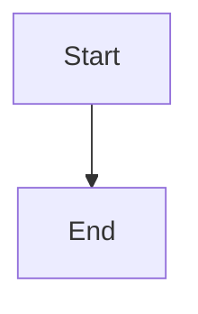
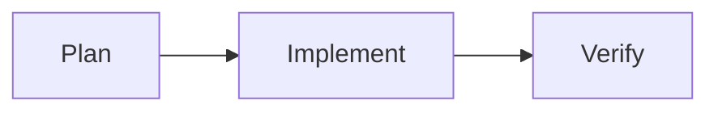
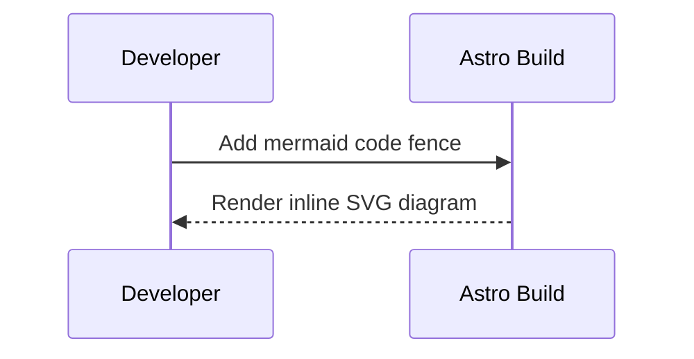

# Mermaid in Markdown Guide

## Overview

This project supports Mermaid diagrams in blog markdown/MDX using build-time rendering. Use fenced code blocks with the `mermaid` language tag.

## Canonical Syntax

````md

````

## Examples

### Flowchart



### Sequence Diagram



## Notes and Limitations

- Scope is currently blog post content rendered through `astro:content` (`src/content/blog`).
- Diagrams are rendered at build time (no client-side Mermaid runtime is shipped).
- Mermaid output follows the current dark site theme.
- Invalid Mermaid syntax can fail the build. Validate diagram syntax before merging.

## Troubleshooting

- If diagrams do not render, ensure the code fence starts with ` ```mermaid ` exactly.
- If local builds fail with browser-launch errors, install Playwright Chromium:
  - `npx playwright install chromium`

---

**Last Updated:** May 9, 2026  
**Category:** guides  
**Related Docs:** [docs/README.md](../README.md)
