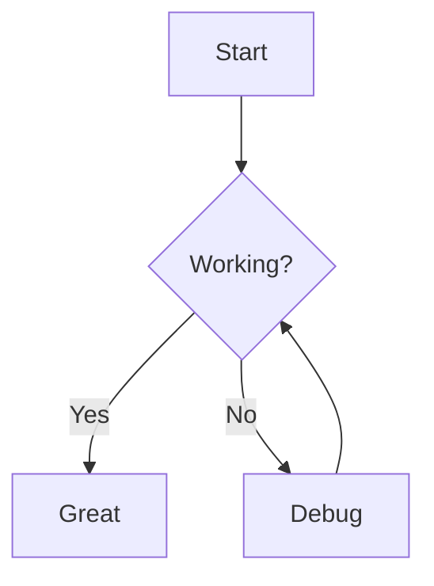
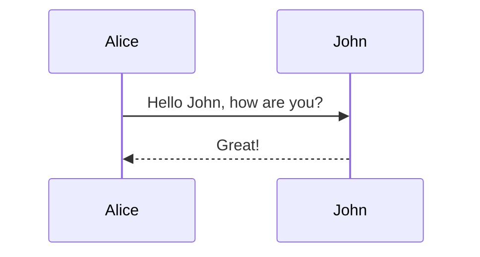
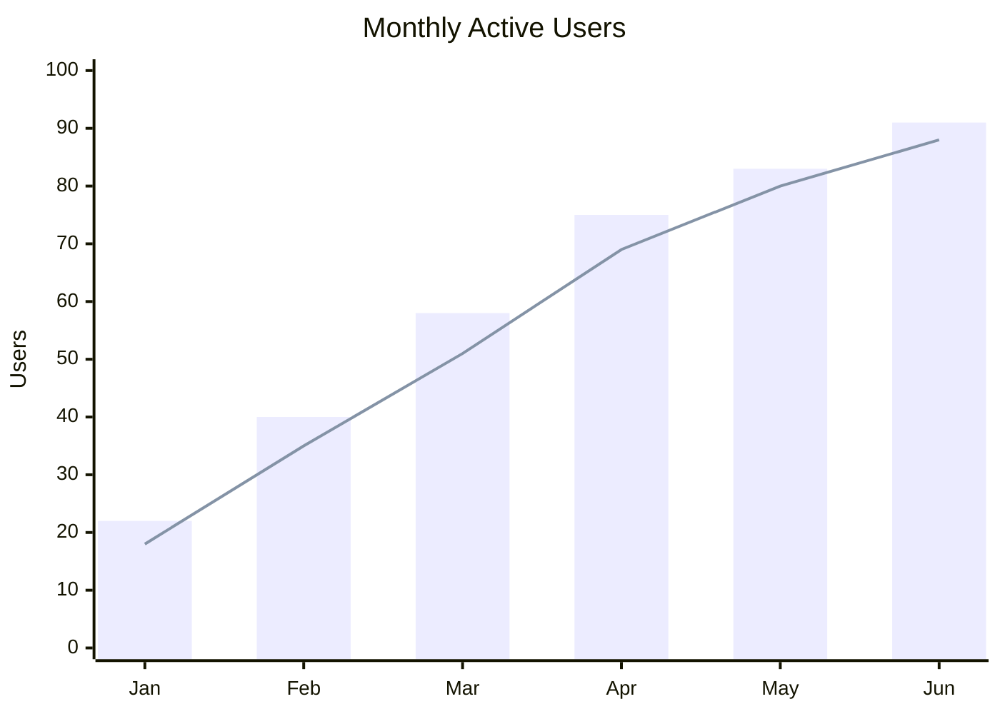

This draft validates Mermaid rendering in blog markdown.

## Flowchart example

```mermaid
flowchart TD
  A[Start] --> B{Working?}
  B -->|Yes| C[Great]
  B -->|No| D[Debug]
  D --> B
```

## Sequence example

```mermaid
sequenceDiagram
  Alice->>John: Hello John, how are you?
  John-->>Alice: Great!
```

## XYChart example

```mermaid
xychart-beta
  title "Monthly Active Users"
  x-axis [Jan, Feb, Mar, Apr, May, Jun]
  y-axis "Users" 0 --> 100
  bar [22, 40, 58, 75, 83, 91]
  line [18, 35, 51, 69, 80, 88]
```

  
    
    Active users (bar)
  
  
    
    Trend line (line)
  

