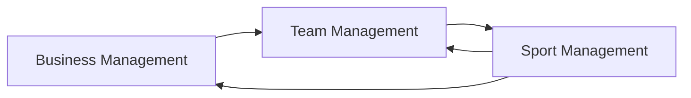
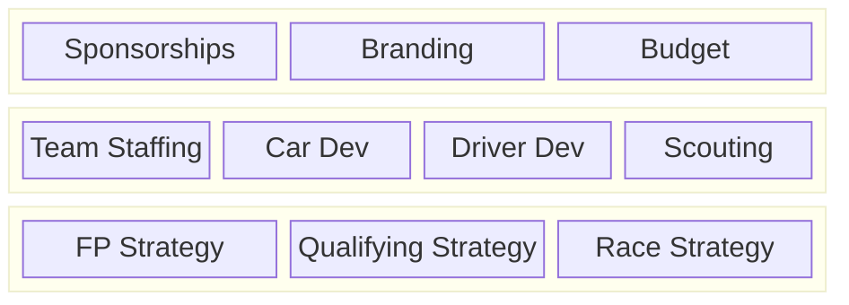

When I built my first computer, the first game I bought was a management game: Sid Meyer's Civilization 5. I would argue this was the first game that got me both into gaming, and into the management genre specifically. When F1 Manager 2022 came out, I instantly bought it on both Xbox and Steam. While I really wanted to like this game, iteration after iteration I found myself wanting more, something different than what we were getting. It wasn't until I played other sports games like Football Manager and Out of the Park Baseball that I realized the many issues with F1 Manager. Given its position in the market, with no real competitors and a renewed interest in the sport, these games were make or break in terms of us getting a quality motorsport management game. When it was announced that F1 Manager 2024 would be the last entry, I really thought we were done for and that the genre was dead, at least until recently. On Steam, a listing for Motorsport Manager 2 was put up, a sequel to the first game that has been effectively dead since the end of the 32-bit era. F1 manager still has potential in the space, but for its next iteration to be successful, it needs to address its shortcomings and build off of what made it successful.

## What Makes a Sport Management Game

Motorsport Management games are a small subset of Sport Management Games, which allows us to look up at other successful games in their respective sports and see what made them good. First we need to identify what properties does a sport management game have. Everything here is more of an "in general" principle and of course not every game is gonna follow these, but in my exploration I have identified these properties and areas that make a game good. For starters there are 3 management areas.

- In Sport Management
- Team Management
- Business Management

In Sport Management is a rather terrible term, but really it means that in each individual unit of competition you manage decisions to help win the competition. In most sports this is a match and of course in F1 its a grand prix, and the decisions very from strategy to roster management to even telling players certain actions.

Team Management is all about decisions made before and after each unit of competition. This is really sport specific but usually involves scouting, training/player development, staffing decisions and scheduling of player activities. Of course there are more things depending on the sport, like in OOTP Baseball you have to manage not just the Major League Roster but also the Minor Leagues. In F1 we have car development as an aspect of team management.

Finally we have Business Management. This is more of a catch-all term for aspects that don't involve the other two categories, and this is the area that is the most different. Common elements are basically options for making money for the team to fund its operations, but this can also include branding and legal. Ultimately the Business Management influences the Team Management, which then Influences the Sport Management. Sport Management also influences Team and Business Management since we often attribute winning to granting more resources for both these areas.

When looking at these areas, its clear that Sport Mangement is the most important area in terms of gameplay for the simple reason that it influences the other two areas. In F1 this is particularly important because you have to worry about a lot of in race decisions such as when to make pit stops and when to deploy energy. On the other hand the business side can often be deprioritized because there is a clear subloop between Sport and Team Management, so ignoring the Business Management in terms of development can be ok.

### Digging into F1

Now lets break down how F1 Manager works. At the base level, Sport Mangement includes all aspects of managing a grand prix weekend, from practice to qualifying to the race itself. The Team Management side includes all aspects related to the team processes, from development to staffing and scouting. Essentially anything that directly impacts how the Sport Management loop is run 

