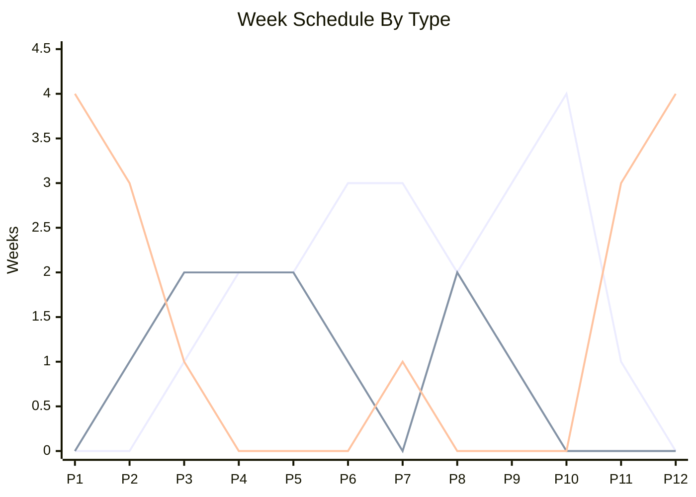

Not to get too philosophical here, but there is something inherently human about the idea of learning. I love the idea of learning new skills and ideas that can help me grow as a person, and its something I advocate for in my workspace and of course try to do it in my personal life as well. However, I have found that I have not been able to do it as much as I want. While I want to say its the lack of time that is causing this, its not the only reason. I have spent months trying to figure out what has been blocking my development, and after stumbling on [this video by Odysseas](https://www.youtube.com/watch?v=Jk4MIYOKapQ), it not only opened my eyes to what my problems were, but also gave me an idea on how to structure my learning now! In this post I will talk about how I developed my personal curriculum, what it includes, and how I plan on keeping up with it over the year.

## Why a Personal Curriculum

One of the biggest struggles I had was a lack of structure. In university, it was really easy for me to learn because there was a tight, rigid structure. On the other side of this though is that school was so rigid I didn't get the chance to explore. Somewhere in between no structure and university level structure lies a level of organization that I think I can be successful under, and that is where the concept of a personal curriculum comes in. It allows me to pick a series of topics and structure them in some way so that I can always be making progress towards my goal.

On the topic of topics, I have two separate but related problems: I want to study a lot of things but also have a problem with dropping topics as well. This is a mentality thing as I feel like when something gets hard or boring I tend to give up. The personal curriculum addresses this by a) allowing you to structure learning on multiple topics together and b) allowing you to be flexible in what materials and ways you learn. I'm hoping this allows me to feel empowered to continue with topics as I get bored with materials.

## Setting Up Our Framework

Every Personal Curriculum is made up of 4 key pillars:

- A schedule
- A place
- A way of practice
- A set of topics

Each of these pillars are meant to provide our structure we want for learning while also being flexible enough for updates and adaptations to improve our learning process. We will talk about our set of topics later, for now I want to tackle the other 3 pillars and how we can set ourselves up for success with them.

### Tackling the Schedule

Aside from tasks, every personal curriculum has 3 things: a schedule, a place, and a way to practice. These 3 things can be custom to what you want but they should be defined. Out of all 3, schedule is the one I found the hardest to manage before and predict I will struggle with the most in this new framework. The main reason is because my work is very different week to week and month to month, but also predictable.We can divide my year up into 3 types of weeks: off weeks, low weeks and high weeks. In a 52 calendar year, we have 16 of each type of week, with 4 weeks reserved as vacation/time off.

Each week type comes with its own benefits and downsides. High weeks tend to be more work heavy and tend to spend more time at the office, which lends itself to being able to use some of that time to do learnings at the office. Low weeks are usually normal hours so more predictable and can easily slot in time for learning. Finally off weeks are great for when I need to spend a bigger block of time learning, but these weeks also tend to be the least predictable as ad-hoc work may come up more often during this time. This means its best to have 3 different types of schedules to help ensure continued momentum in realistic ways to my life.

In terms of yearly planning we want to figure out the best time to start and end our year curriculum. In our case this year timeline doesn't mean get everything done, but rather means we have a year to focus on this iteration and we can do a big update after a year. It helps to visualize a breakdown of week types by month.

  
    
    Off Weeks
  
  
    
    Low Weeks
  
  
    
    High Weeks
  

From this we can see a period of relative calm at the ends while the middle months tend to be busier. From this we can do one of 3 schedules:

- November -> October: The benefit of this is that our off week period is maximized at the beginning of the schedule while we end in a busy portion of time in October.
- April -> March: While a little unorthodox, it moves our off week period to the end, in the hopes of capitalizing on that momentum to get to the end.
- January -> December: Traditional year calendar.

For myself, I felt like November to October is the best for getting a high amount of momentum, so while we are starting our curriculum for 2026 now, we will use these extra 6 months to refine and develop our practice better so when the schedule does officially stat we are in a better place. We will also do an update at the start of our year in November. We'll go over our schedule in the topics section later.

### Our Place for Knowledge

The next pillar is place, and while I initially thought it meant where I was gonna learn, it actually means where will I keep my learnings. This is actually the easiest for me to set up because I already have a pretty good setup going for this.

For our notes, we will be using Obsidian to keep track of things. I like obsidian a lot because its local and offline, can be extended to have numerous features that other apps have, and is markdown based which is a format I love to work in. I already started using the Zettelkasten approach of a course I was taking and I think that given my topic choice, combined with Obsidian's reference linking, will allow me to have a better understanding of my knowledge base. It also requires very little organization which will help me with not losing momentum due to disorganization.

Any coding projects will (for now) be on GitHub. While it has many faults (more so recently), I am pretty well set up in it and its where most of my projects are stored currently. This also has the most potential for change due to how easy it is to change providers and the trajectory of the product.

Finally, any deliverables I am able to create will be published on this site here. I'm hoping to do things like mini essays, papers, and even apps that people can use. What use is a personal website if you can't post the cool things you do in life on it!

### Practicing our Craft

The final pillar is practice, which is how are we planning on validating and proving our knowledge. While this sounds a little harsh, we ultimately want to prove what we know and identify what we don't so that we can target our learning better. My goal is to have a couple deliverables for each project in some of the following forms:

- Apps/Sites
- Papers
- Blog Posts

In addition to deliverables, we want to use our obsidian to link topics together for stronger connection and easier review. One of the other things we will try is using AI to help with our learning. While AI is a controversial topic, there are a couple uses for it that I see myself benefiting from, such as knowledge searching and generation of review materials. Our goal is to not use AI to help generate the content but rather as a tool to create some of the resources traditional learning is good at. This will be an experiment and we will track its effectiveness. 

## Our 2026 Topics

