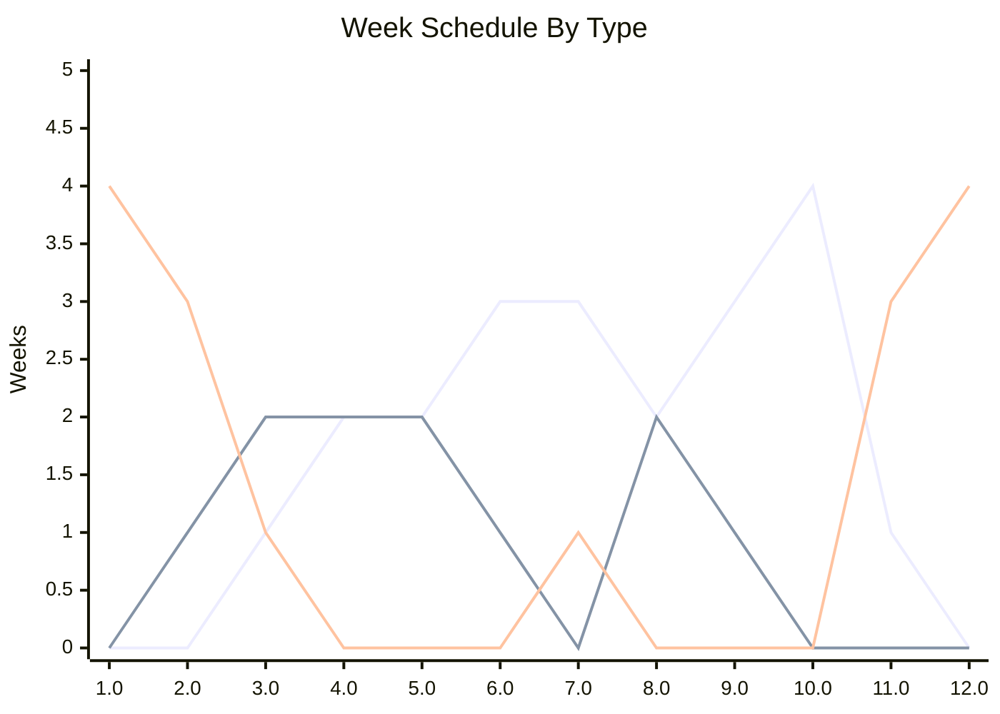

Not to get too philosophical here, but there is something inherently human about the idea of learning. I love the idea of learning new skills and ideas that can help me grow as a person, and its something I advocate for in my workspace and of course try to do it in my personal life as well. However, I have found that I have not been able to do it as much as I want. While I want to say its the lack of time that is causing this, its not the only reason. I have spent months trying to figure out what has been blocking my development, and after stumbling on [this video by Odysseas](https://www.youtube.com/watch?v=Jk4MIYOKapQ), it not only opened my eyes to what my problems were, but also gave me an idea on how to structure my learning now! In this post I will talk about how I developed my personal curriculum, what it includes, and how I plan on keeping up with it over the year.

## Why a Personal Curriculum

One of the biggest struggles I had was a lack of structure. In university, it was really easy for me to learn because there was a tight, rigid structure. On the other side of this though is that school was so rigid I didn't get the chance to explore. Somewhere in between no structure and university level structure lies a level of organization that I think I can be successful under, and that is where the concept of a personal curriculum comes in. It allows me to pick a series of topics and structure them in some way so that I can always be making progress towards my goal.

On the topic of topics, I have two separate but related problems: I want to study a lot of things but also have a problem with dropping topics as well. This is a mentality thing as I feel like when something gets hard or boring I tend to give up. The personal curriculum addresses this by a) allowing you to structure learning on multiple topics together and b) allowing you to be flexible in what materials and ways you learn. I'm hoping this allows me to feel empowered to continue with topics as I get bored with materials.

## Tackling the Schedule

Aside from tasks, every personal curriculum has 3 things: a schedule, a place, and a way to practice. These 3 things can be custom to what you want but they should be defined. Out of all 3, schedule is the one I found the hardest to manage before and predict I will struggle with the most in this new framework. The main reason is because my work is very different week to week and month to month, but also predictable.We can divide my year up into 3 types of weeks: off weeks, low weeks and high weeks. In a 52 calendar year, we have 16 of each type of week, with 4 weeks reserved as vacation/time off.

Each week type comes with its own benefits and downsides. High weeks tend to be more work heavy and tend to spend more time at the office, which lends itself to being able to use some of that time to do learnings at the office. Low weeks are usually normal hours so more predictable and can easily slot in time for learning. Finally off weeks are great for when I need to spend a bigger block of time learning, but these weeks also tend to be the least predictable as ad-hoc work may come up more often during this time. This means its best to have 3 different types of schedules to help ensure continued momentum in realistic ways to my life.

In terms of yearly planning we want to figure out the best time to start and end our year curriculum. In our case this year timeline doesn't mean get everything done, but rather means we have a year to focus on this iteration and we can do a big update after a year. It helps to visualize a breakdown of week types by month.

  
    
    Active users (bar)
  
  
    
    Trend line (line)
  

